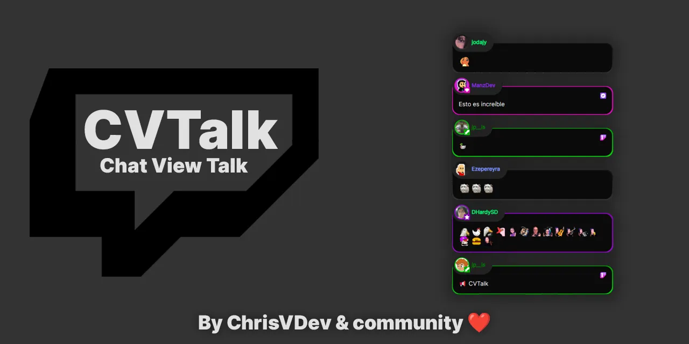

# CVTalk
CVtalk is a web application created with the aim of serving as a chat viewer for your Twitch channel and integrating many more functionalities:

 - You can apply your own style if you know CSS or choose from the styles the community kindly provides.
 - Play with the integrations it offers, propose or program your own.
 - Easily and enjoyably use a TTS (Text-to-Speech) feature.
 - Filter links, and much more.

### Made by developers who love Twitch and enjoy seeing their community grow. ❤️

## 👀 Want to learn more?

Feel free to check [our discord](https://discord.gg/z9aCST4YpP) or jump into our [Twitch](https://www.twitch.tv/chrisvdev).
