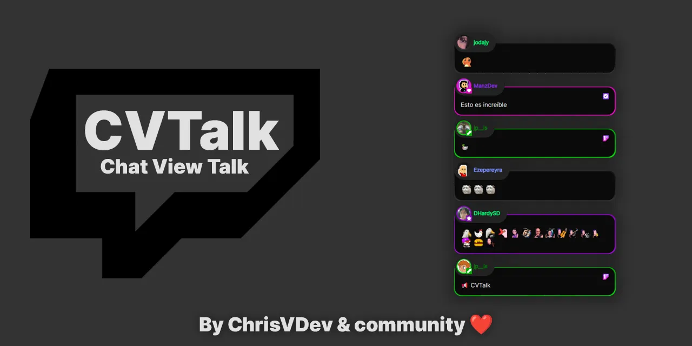

# 🎮 CVTalk

Widget de chat de Twitch moderno y extensible para OBS Studio, construido con Astro y Web Components.


**🌐 Demo en vivo:** [https://chrisvdev.github.io/CVTalk/](https://chrisvdev.github.io/CVTalk/)

## 🏗️ Arquitectura del Proyecto

CVTalk es parte de un ecosistema de proyectos para Twitch:

- **[MTMI](https://github.com/ManzDev/mtmi)** - Librería base para conexión IRC de Twitch (by ManzDev)
- **[mtmi-async-badges](https://github.com/chrisvdev/mtmi-async-badges)** - Paquete para carga asíncrona de badges con persistencia localStorage
- **CVTalk** (este proyecto) - Widget para OBS que consume ambos paquetes

```
MTMI (IRC Client) + mtmi-async-badges (Badges CDN)
                    ↓
              CVTalk Widget
                    ↓
         OBS Studio Browser Source
```

## ✨ Características

- 🔌 **Conexión en tiempo real** a Twitch IRC usando [mtmi](https://github.com/ManzDev/mtmi)
- 🎨 **Personalización visual** con ornamentos según roles (broadcaster, mod, VIP, suscriptor)
- 🦆 **Sistema de efectos extensible** para procesar mensajes (incluye PatoBotTribute)
- 🖼️ **Avatares y badges** de usuarios cargados dinámicamente
- ⏱️ **Auto-expiración** configurable de mensajes
- 🎯 **Configuración por URL** - fácil integración con OBS
- 🌈 **Curación de colores** para mejor legibilidad
- 🏗️ **Componentes Web nativos** - sin frameworks pesados en el frontend
- 📦 **Build optimizado** con Astro para máximo rendimiento

## 🚀 Inicio Rápido

### Requisitos Previos

- Node.js >= 22.12.0
- pnpm (recomendado) o npm

### Instalación

```bash
# Clonar el repositorio
git clone https://github.com/chrisvdev/CVTalk.git
cd CVTalk

# Instalar dependencias
pnpm install

# Iniciar servidor de desarrollo
pnpm dev
```

El servidor estará disponible en `http://localhost:4321`

### Uso en OBS Studio

#### Opción 1: Usar la versión desplegada (Recomendado)

Agrega una **Browser Source** en OBS con la URL de producción:
```
https://chrisvdev.github.io/CVTalk/?channel=tu_canal_twitch
```

#### Opción 2: Desarrollo local

1. Construye el proyecto para producción:
   ```bash
   pnpm build
   ```

2. Previsualiza el build localmente:
   ```bash
   pnpm preview
   ```

3. Agrega una **Browser Source** en OBS con la URL local:
   ```
   http://localhost:4321/?channel=tu_canal_twitch
   ```

#### Configuración de OBS

- **Dimensiones recomendadas**: 1920x1080
- **FPS personalizado**: 60
- **Shutdown source when not visible**: Desactivado (recomendado)

## 🎛️ Configuración

Configura el widget mediante parámetros URL:

| Parámetro | Tipo | Default | Descripción |
|-----------|------|---------|-------------|
| `channel` | string | - | **Requerido**. Nombre del canal de Twitch |
| `messageTTL` | number | `10000` | Tiempo de vida de mensajes (ms) |
| `pato_bot` | boolean | `false` | Habilitar efecto PatoBot (*quack*) 🦆 |
| `mute_bots` | boolean | `false` | Silenciar mensajes de bots 🤖 |
| `mute_replays` | boolean | `false` | Silenciar mensajes que son respuestas 💬 |
| `mute_prefixes` | string | `""` | Prefijos para silenciar comandos (separados por comas) 🔇 |
| `tts` | string | `""` | Habilitar funcionalidad TTS (Text-to-Speech) 🔊 |
| `tts_accent` | string | `"es-AR"` | Acento predeterminado para TTS (ej: es-AR, en-US) 🌍 |
| `tts_variant` | number | `1` | Variante de voz predeterminada (1-n) 🎙️ |
| `insecureHTML` | string | `""` | ⚠️ Permitir HTML en mensajes: `"onCommand"` (con $html) o `"onHighlight"` ⚡ |
| `remoteAdmin` | string | `""` | 🎛️ Control remoto: `"streamer"` (solo streamer) o `"moderators"` (streamer + mods) 🔐 |

### Ejemplos

```bash
# Configuración básica
?channel=micanal

# Con mensaje TTL personalizado (20 segundos)
?channel=micanal&messageTTL=20000

# Con efecto PatoBot habilitado
?channel=micanal&pato_bot=true

# Silenciar bots, respuestas y comandos
?channel=micanal&mute_bots=true&mute_replays=true&mute_prefixes=!,.,/

# Con TTS habilitado (español de Argentina, variante 1)
?channel=micanal&tts=true&tts_accent=es-AR&tts_variant=1

# ⚠️ Con HTML habilitado en comandos (USAR CON PRECAUCIÓN)
?channel=micanal&insecureHTML=onCommand

# 🎛️ Con control remoto para streamer (puede cambiar propiedades desde el chat)
?channel=micanal&remoteAdmin=streamer

# 🔐 Con control remoto para streamer y moderadores
?channel=micanal&remoteAdmin=moderators
```

### ✨ Efectos Incluidos

CVTalk incluye varios efectos que procesan los mensajes antes de mostrarlos:

- **😺 cuteMichi**: Convierte `:3` en "AliMoyi"
- **❤️ afordiLove**: Reemplaza `<3` y `❤️` con el emote "afordiLove"
- **🚫🔗 antiLinks**: Censura URLs (excepto para mods y broadcaster)
- **🦆 antiGoose**: Reemplaza "goose"/"ganso" por "duck"/"pato"
- **🚫📏 antiLongWords**: Censura palabras excesivamente largas (spam)
- **🦆 PatoBotTribute**: Reproduce sonido de pato al detectar `*quack*` (configurable)
- **🤖 muteBots**: Oculta mensajes de bots (configurable)
- **💬 muteReplays**: Oculta mensajes que son respuestas (configurable)
- **🔇 muteCommandsByPrefix**: Oculta comandos por prefijo (configurable)
- **⚡ insecureHTML**: ⚠️ Permite HTML controlado en mensajes (configurable, usar con precaución)
- **🎙️ commandsProcessor**: Procesador de comandos TTS y control remoto (habilitado con `tts=true` o `remoteAdmin`)

Ver [documentación completa de efectos](docs/EFFECTS.md) para más detalles.

## 🎛️ Control Remoto del Widget (remoteAdmin)

🔐 **CARACTERÍSTICA DE ADMINISTRACIÓN REMOTA**

CVTalk permite controlar las propiedades del widget en tiempo real desde el chat de Twitch, sin necesidad de recargar la página. Esta funcionalidad está **deshabilitada por defecto**.

### Modos de Seguridad

1. **`remoteAdmin=""` (default)**: Deshabilitado - nadie puede ejecutar comandos remotos
2. **`remoteAdmin=streamer`**: Solo el streamer/broadcaster puede ejecutar comandos
3. **`remoteAdmin=moderators`**: El streamer y los moderadores pueden ejecutar comandos

### Comandos Disponibles

| Comando | Descripción |
|---------|-------------|
| `!remoteAdmin <propiedad> <valor>` | Comando completo para cambiar propiedades |
| `!cvsudo <propiedad> <valor>` | Alias corto del comando |

### Propiedades Modificables

| Propiedad | Tipo | Ejemplo |
|-----------|------|---------|
| `messageTTL` | number | `!cvsudo messageTTL 15000` |
| `pato_bot` | boolean | `!remoteAdmin pato_bot true` |
| `mute_bots` | boolean | `!cvsudo mute_bots false` |
| `mute_replays` | boolean | `!remoteAdmin mute_replays true` |
| `mute_prefixes` | string | `!cvsudo mute_prefixes !,.,/` |
| `tts` | string | `!remoteAdmin tts true` |
| `tts_accent` | string | `!cvsudo tts_accent es-MX` |
| `tts_variant` | number | `!remoteAdmin tts_variant 2` |
| `insecureHTML` | string | `!cvsudo insecureHTML onCommand` |

### Propiedades Protegidas (NO modificables)

- ❌ `remoteAdmin` - No se puede cambiar su propio nivel de seguridad
- ❌ `baseUrl` - URL base del sistema
- ❌ `channel` - Canal de Twitch conectado

### Ejemplos de Uso

```bash
# Habilitar en modo streamer
?channel=micanal&remoteAdmin=streamer

# En el chat, el streamer puede escribir:
!cvsudo pato_bot true          # Activa PatoBot
!remoteAdmin messageTTL 20000  # Cambia TTL a 20 segundos
!cvsudo tts_accent es-MX       # Cambia acento TTS a mexicano
```

```bash
# Habilitar para moderadores también
?channel=micanal&remoteAdmin=moderators

# Ahora tanto el streamer como los mods pueden usar:
!cvsudo mute_bots true
!remoteAdmin insecureHTML onCommand
```

### ⚠️ Consideraciones de Seguridad

- **Control total**: Los comandos remotos pueden cambiar cualquier configuración del widget
- **Moderadores de confianza**: Solo usar modo `moderators` con mods de alta confianza
- **Logs en consola**: Todos los comandos se registran en la consola del navegador
- **Cambios en vivo**: Los cambios se aplican inmediatamente sin recargar

### Casos de Uso

- 🎮 **Streams interactivos**: Ajustar configuración en respuesta a eventos
- 🎪 **Testing en vivo**: Probar diferentes configuraciones durante el stream
- 🔧 **Debugging**: Cambiar parámetros para diagnosticar problemas
- 🎨 **Personalización dinámica**: Adaptar el widget según el contenido

## ⚡ HTML en Mensajes (insecureHTML)

⚠️ **CARACTERÍSTICA EXPERIMENTAL Y POTENCIALMENTE PELIGROSA**

CVTalk permite la inyección controlada de HTML en mensajes del chat. Esta funcionalidad está **deshabilitada por defecto** y debe usarse solo en entornos controlados donde confías en los usuarios.

### Modos de Activación

1. **`insecureHTML=onCommand`**: Permite HTML solo en mensajes que empiezan con `$html`
   ```
   Usuario: $html <b>Texto en negrita</b> y <i>cursiva</i>
   ```

2. **`insecureHTML=onHighlight`**: Permite HTML solo en mensajes destacados (highlighted messages)
   ```
   [Usuario con mensaje destacado]: <span style="color: red;">Mensaje importante</span>
   ```

### Filtros de Seguridad

Se bloquean automáticamente las siguientes etiquetas y atributos peligrosos:
- `<script>` - Ejecución de JavaScript
- `<iframe>` - Carga de contenido externo
- `<object>` - Objetos embebidos
- `<details>` - Elementos interactivos
- `onload`, `onerror` - Eventos JavaScript inline

### ⚠️ Advertencias de Seguridad

- **NO** garantiza protección total contra XSS (Cross-Site Scripting)
- Usar **SOLO** en streams privados o con comunidad de confianza
- Los usuarios pueden usar CSS para modificar la apariencia del chat
- Posibles riesgos: robo de cookies, phishing, defacement

### Ejemplo de Uso Seguro

```bash
# Solo permitir HTML en comandos específicos
?channel=micanal&insecureHTML=onCommand

# Ahora los usuarios pueden usar:
# $html <marquee>¡Texto en movimiento!</marquee>
# $html <span style="font-size: 2em;">Grande</span>
```

## 🎙️ Sistema TTS (Text-to-Speech)

CVTalk incluye un sistema completo de síntesis de voz que permite a los usuarios del chat sintetizar mensajes con diferentes acentos y voces.

### Comandos TTS Disponibles

| Comando | Descripción | Ejemplo |
|---------|-------------|---------|
| `!speak <texto>` | Sintetiza el texto con configuración predeterminada | `!speak Hola mundo` |
| `!s <texto>` | Alias corto de !speak | `!s Hola` |
| `!speak <acento> <texto>` | Sintetiza con acento específico | `!speak es-MX Hola desde México` |
| `!speak <acento> <variante> <texto>` | Sintetiza con acento y variante específicos | `!speak es-AR 2 Hola Argentina` |
| `!speak -config <acento> [variante]` | Configura acento personalizado del usuario | `!speak -config es-AR 2` |
| `!speak -reset` | Resetea la configuración personalizada | `!speak -reset` |

### Acentos Disponibles

Los acentos disponibles dependen del navegador/sistema. Ejemplos comunes:

- **Español**: `es-ES` (España), `es-MX` (México), `es-AR` (Argentina), `es-US` (Estados Unidos)
- **Inglés**: `en-US` (Estados Unidos), `en-GB` (Reino Unido), `en-AU` (Australia)
- **Otros**: `pt-BR` (Portugués Brasil), `fr-FR` (Francés), `de-DE` (Alemán), etc.

### Personalización TTS

Cada usuario puede configurar su propio acento y variante que se aplicará automáticamente a sus mensajes:

```
Usuario: !speak -config es-AR 2
[Se configura la voz española argentina, variante 2]

Usuario: !speak Hola chat
[Sintetiza "Hola chat" con la configuración guardada: es-AR, variante 2]
```

La configuración se guarda en `localStorage` del navegador y persiste entre sesiones.

## 🏗️ Estructura del Proyecto

```text
/
├── public/
│   ├── assets/
│   │   ├── audio/          # Archivos de audio (quack.mp3)
│   │   ├── fonts/          # Fuentes personalizadas
│   │   └── styles/         # Estilos CSS globales
│   └── favicon.ico
├── src/
│   ├── components/         # Web Components
│   │   ├── chat-view/      # Contenedor principal del chat
│   │   └── user-message/   # Mensaje individual de usuario
│   ├── lib/                # Utilidades y lógica de negocio
│   │   ├── efects_loop/    # Sistema de efectos
│   │   │   ├── index.ts    # EfectsLoop core
│   │   │   └── efects/     # Efectos disponibles
│   │   │       └── pato_bot_tribute.ts
│   │   ├── get_curated_color.ts
│   │   ├── get_ornament.ts
│   │   └── mock_messages.ts
│   ├── pages/
│   │   └── index.astro     # Página principal
│   └── scripts/
│       ├── global.ts       # Configuración global
│       └── start.ts        # Inicialización del cliente IRC
└── package.json
```

## 🔌 Sistema de Efectos

CVTalk incluye un sistema extensible de efectos que permite procesar mensajes antes de renderizarlos.

### Cómo funciona

Los efectos son funciones middleware que se ejecutan secuencialmente en una cadena de procesamiento:

```typescript
Message → Effect 1 → Effect 2 → Effect N → Render
```

### Crear un efecto personalizado

```typescript
import type { Effect } from "@/lib/efects_loop";
import { type UserMessageInfoType } from "mtmi";

export default class MiEfecto {
  constructor() {
    // Inicialización
  }
  
  public getEfect(): Effect {
    return (message, next) => {
      // Procesar el mensaje
      if (message.message.includes("palabra_clave")) {
        // Modificar el mensaje o ejecutar lógica
        message.userInfo.color = "#FF0000";
      }
      
      // Llamar al siguiente efecto
      next();
    }
  }
}
```

### PatoBotTribute Effect

🦆 **Tributo a PatoBot** - Homenaje al legendario bot creado por **Nivek el pato** (PatitoDev), un querido amigo y gran creador de contenido que se retiró del streaming. Este efecto mantiene vivo su legado en la comunidad.

**Características:**
- 🦆 Reproduce sonido de pato cuando detecta `*quack*` en mensajes
- 🖼️ Cambia el avatar del usuario por uno aleatorio de pato
- 🔊 Maneja políticas de autoplay del navegador con desbloqueo inteligente

**Uso:**
```
?channel=micanal&pato_bot=true
```

> 💙 **Nota**: Este efecto es un tributo cariñoso a PatoBot, que aunque ya no está en funcionamiento, dejó una marca especial en la comunidad de streaming.

## 🛠️ Comandos Disponibles

| Comando | Acción |
|---------|--------|
| `pnpm dev` | Inicia servidor de desarrollo en `localhost:4321` |
| `pnpm build` | Construye para producción en `./dist/` |
| `pnpm preview` | Previsualiza el build de producción |
| `pnpm astro` | Ejecuta comandos CLI de Astro |

## 🎨 Personalización Visual

### Ornamentos por Rol

Los mensajes se decoran automáticamente según el rol del usuario:

- 👑 **Broadcaster** - Propietario del canal
- 🔧 **Moderator** - Moderador
- 💎 **VIP** - VIP del canal
- ⭐ **Subscriber** - Suscriptor

### Curación de Colores

Los colores de usuario se procesan para mejorar la legibilidad, oscureciéndolos automáticamente para un mejor contraste sobre fondos oscuros.

### Estilos CSS

Personaliza la apariencia editando:
- `public/assets/styles/user-message.css` - Estilos de mensajes
- `public/assets/styles/chat-view.css` - Estilos del contenedor
- `public/assets/styles/fonts.css` - Fuentes personalizadas

## 📚 Dependencias Principales

- **[Astro](https://astro.build)** `^6.1.3` - Framework SSG de alto rendimiento
- **[mtmi](https://github.com/ManzDev/mtmi)** `^0.0.19` - Cliente Twitch IRC read-only by [ManzDev](https://github.com/ManzDev)
- **[mtmi-async-badges](https://github.com/chrisvdev/mtmi-async-badges)** `^1.0.6` - Badges de Twitch con carga asíncrona y persistencia localStorage (desarrollo propio)

## 🐛 Debugging

### El chat no se conecta

- Verifica que el parámetro `channel` esté en la URL
- Comprueba la consola del navegador para errores de conexión IRC
- Asegúrate de que el canal exista y esté activo

### Los mensajes no aparecen

- Verifica que `ChatView` esté correctamente inicializado
- Comprueba los listeners de eventos en la consola
- Revisa que el `messageTTL` no sea demasiado corto

### El audio no se reproduce

- Los navegadores requieren interacción del usuario antes de reproducir audio
- En OBS, el audio debería funcionar automáticamente
- Verifica que el archivo `quack.mp3` exista en `public/assets/audio/`

## 🤝 Contribuir

Las contribuciones son bienvenidas! Por favor:

1. Fork el proyecto
2. Crea una rama para tu feature (`git checkout -b feature/AmazingFeature`)
3. Commit tus cambios usando conventional commits (`git commit -m '✨ feat: add amazing feature'`)
4. Push a la rama (`git push origin feature/AmazingFeature`)
5. Abre un Pull Request

## 📄 Licencia

Este proyecto está bajo la Licencia MIT. Ver el archivo `LICENSE` para más detalles.

## 👨‍💻 Autor

**Christian Villegas (ChrisVDev)**
- Email: christian@chrisvdev.com
- GitHub: [@chrisvdev](https://github.com/chrisvdev)

## 🙏 Agradecimientos

- [mtmi](https://github.com/ManzDev/mtmi) por el excelente cliente de Twitch IRC - Gracias [ManzDev](https://github.com/ManzDev)!
- [Astro](https://astro.build) por el excelente framework
- **Nivek el pato / PatitoDev** por el legado de PatoBot 🦆💙 - Un amigo y creador de contenido que dejó huella en la comunidad
- La comunidad de Twitch por el apoyo continuo

---

Hecho con ❤️ para la comunidad de streamers
