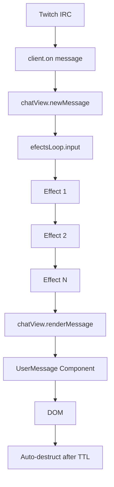

# 📚 API Documentation - CVTalk

Documentación completa de la API interna de CVTalk.

## 🌐 Objeto Global: `window.OBSChat`

Objeto global que gestiona la configuración y estado de la aplicación.

### Properties

```typescript
interface OBSChat {
  notifications?: NotificationsView
  properties?: Properties
  appCustomElements?: Record<string, CustomElementConstructor>
  addCustomElement: (name: string, constructor: CustomElementConstructor) => void
  messages: Record<string, Message>
  addMessage: (messageInfo: UserMessageInfoType) => string
}

#### `notifications`

Instancia del componente `NotificationsView` cuando las funcionalidades experimentales están habilitadas y el widget ha inicializado el sistema de notificaciones.
```

#### `properties`

Configuración global de la aplicación.

```typescript
type Properties = {
  channel?: string              // Canal de Twitch
  messageTTL: number           // Tiempo de vida de mensajes (ms)
  pato_bot: boolean            // Habilitar PatoBotTribute
  mute_bots: boolean           // Silenciar mensajes de bots
  mute_replays: boolean        // Silenciar mensajes que son respuestas
  mute_prefixes: string        // Prefijos para silenciar comandos (separados por comas)
  tts: string                  // Habilitar TTS ("true" o "")
  tts_accent: string           // Acento predeterminado para TTS (ej: es-AR, en-US)
  tts_variant: number          // Variante de voz predeterminada (1-n)
  experimental_features: boolean // ⚡ Activar funcionalidades experimentales (notificaciones)
  insecureHTML: string         // Permitir HTML: "" | "onCommand" | "onHighlight"
  remoteAdmin: string          // Control remoto: "" | "streamer" | "moderators"
  baseUrl: string              // URL base de la aplicación (siempre termina con /)
}
```

**Valores por defecto:**
```typescript
{
  messageTTL: 10000,
  pato_bot: false,
  mute_bots: false,
  mute_replays: false,
  mute_prefixes: '',
  tts: '',
  tts_accent: 'es-AR',
  tts_variant: 1,
  experimental_features: false,
  insecureHTML: '',
  remoteAdmin: '',
  baseUrl: '/'
}
```

**Acceso desde código:**
```typescript
// ✅ Forma correcta - sistema tipado
const baseUrl = window.OBSChat.properties?.baseUrl || '/'

// ❌ Forma antigua - NO USAR
// window.__BASE_URL__
```

#### `appCustomElements`

Registro de todos los custom elements definidos.

```typescript
{
  "chat-view": ChatView,
  "user-message": UserMessage
}
```

#### `addCustomElement(name, constructor)`

Registra un nuevo custom element en la aplicación.

**Parámetros:**
- `name` (string): Nombre del elemento (ej: "my-component")
- `constructor` (CustomElementConstructor): Clase que extiende HTMLElement

**Ejemplo:**
```typescript
window.OBSChat.addCustomElement("my-component", MyComponent)
```

#### `messages`

Almacén de mensajes activos indexados por ID.

```typescript
messages: Record<string, Message>
```

**Estructura de Message:**
```typescript
type Message = UserMessageInfoType & {
  delete: () => void
}
```

#### `addMessage(messageInfo)`

Agrega un mensaje al almacén global.

**Parámetros:**
- `messageInfo` (UserMessageInfoType): Información del mensaje

**Retorna:** `string` - ID único del mensaje

**Ejemplo:**
```typescript
const messageId = window.OBSChat.addMessage(message)
```

## 🎨 Custom Elements

### ChatView

Componente principal que gestiona la lista de mensajes.

```typescript
class ChatView extends HTMLElement {
  list: HTMLUListElement | null
  efectsLoop: EfectsLoop
  
  constructor()
  newMessage(message: UserMessageInfoType): void
  private renderMessage(message: UserMessageInfoType): void
}
```

#### Propiedades

- **`list`**: Referencia al elemento `<ul>` que contiene los mensajes
- **`efectsLoop`**: Instancia del sistema de procesamiento de efectos

#### Métodos

##### `newMessage(message)`

Procesa un nuevo mensaje a través del sistema de efectos.

**Parámetros:**
- `message` (UserMessageInfoType): Mensaje de Twitch IRC

**Ejemplo:**
```typescript
chatView.newMessage({
  type: "message",
  username: "usuario",
  message: "Hola chat!",
  // ...
})
```

##### `renderMessage(message)` (private)

Renderiza un mensaje procesado en el DOM.

### UserMessage

Componente que muestra un mensaje individual de usuario.

```typescript
class UserMessage extends HTMLElement {
  static observedAttributes: string[]
  
  constructor(element?: HTMLElement)
  attributeChangedCallback(name: string, old: string | null, now: string): void
  private onNewMessage(message: UserMessageInfoType): void
  private selfDestruct(): void
}
```

#### Atributos Observados

- **`message`**: ID del mensaje en `window.OBSChat.messages`

#### Métodos

##### `onNewMessage(message)` (private)

Renderiza la información del mensaje en el componente.

**Elementos actualizados:**
- Avatar del usuario
- Nombre de usuario con color
- Badges primarios y secundarios
- Contenido del mensaje
- Ornamentos según rol

##### `selfDestruct()` (private)

Inicia temporizador de auto-destrucción basado en `messageTTL`.

**Flujo:**
1. Espera `messageTTL` ms
2. Agrega clase `fade-out`
3. Espera 1000ms (animación)
4. Elimina elemento del DOM
5. Elimina mensaje de `window.OBSChat.messages`

## 🔌 Sistema de Efectos

### EfectsLoop

Gestor de cadena de efectos para procesamiento de mensajes.

```typescript
class EfectsLoop {
  private effects: Effect[]
  private outputs: Output[]
  
  addEffect(effect: Effect): void
  addOutput(output: Output): void
  input(message: UserMessageInfoType): void
  private outputEffect(message: UserMessageInfoType): void
}
```

#### Métodos

##### `addEffect(effect)`

Agrega un efecto a la cadena de procesamiento.

**Parámetros:**
- `effect` (Effect): Función de efecto

**Ejemplo:**
```typescript
efectsLoop.addEffect((message, next) => {
  console.log(message.message)
  next()
})
```

##### `addOutput(output)`

Agrega una función de salida para mensajes procesados.

**Parámetros:**
- `output` (Output): Función que recibe mensaje final

**Ejemplo:**
```typescript
efectsLoop.addOutput((message) => {
  console.log("Mensaje listo:", message)
})
```

##### `input(message)`

Procesa un mensaje a través de todos los efectos.

**Parámetros:**
- `message` (UserMessageInfoType): Mensaje a procesar

### Types

```typescript
type Effect = (message: UserMessageInfoType, next: RunNextEffect) => void
type RunNextEffect = () => void
type Output = (message: UserMessageInfoType) => void
```

## 🛠️ Utilidades

### getCuratedColor

Genera un color RGB oscurecido para mejor legibilidad.

```typescript
function getCuratedColor(color: string | undefined): string
```

**Parámetros:**
- `color`: Color hexadecimal (`#RRGGBB`) o `undefined` para aleatorio

**Retorna:** Color en formato `rgb(r, g, b)`

**Ejemplo:**
```typescript
const color = getCuratedColor("#FF0000")
// Retorna: "rgb(255, 128, 128)"
```

### getOrnament

Determina el ornamento (rol) de un usuario.

```typescript
function getOrnament(message: UserMessageInfoType): OrnamentClass
```

**Parámetros:**
- `message`: Información del mensaje

**Retorna:** `"broadcaster" | "moderator" | "vip" | "subscriber" | ""`

**Ejemplo:**
```typescript
const ornament = getOrnament(message)
if (ornament) {
  element.classList.add(ornament)
}
```

### getPythonesaMessage

Genera un mensaje mock para pruebas o mensajes del sistema.

```typescript
function getPythonesaMessage(message: string): UserMessageInfoType
```

**Parámetros:**
- `message`: Texto del mensaje

**Retorna:** Objeto `UserMessageInfoType` completo

**Ejemplo:**
```typescript
const mockMsg = getPythonesaMessage("Error: Canal no especificado")
chatView.newMessage(mockMsg)
```

### useTemplate

Clona y agrega un template HTML al elemento.

```typescript
function useTemplate(
  element: HTMLElement,
  templateSelector: string,
  contentSelector?: string
): void
```

**Parámetros:**
- `element`: Elemento donde se clonará el template
- `templateSelector`: Selector CSS del template
- `contentSelector`: (Opcional) Selector del contenedor de contenido

**Ejemplo:**
```typescript
useTemplate(this, "#user-message", ".message")
```

### createTimeout

Crea un timeout que se puede limpiar globalmente.

```typescript
function createTimeout(callback: () => void, ms: number): number
```

**Parámetros:**
- `callback`: Función a ejecutar
- `ms`: Milisegundos de espera

**Retorna:** ID del timeout

**Ejemplo:**
```typescript
const timeoutId = createTimeout(() => {
  console.log("Ejecutado después de 1s")
}, 1000)
```

## 📡 Cliente Twitch IRC

### Conexión

```typescript
import { client } from "mtmi"

client.connect({
  channels: [channel],
  badges: badges,
  avatarProvider: "decapi"
})
```

### Eventos

```typescript
// Mensaje de chat
client.on("message", (message: UserMessageInfoType) => {
  chatView.newMessage(message)
})

// Suscripción
client.on("sub", (data) => {
  console.log("SUB:", data)
})

// Resuscripción
client.on("resub", (data) => {
  console.log("RESUB:", data)
})

// Regalo de suscripción
client.on("subgift", (data) => {
  console.log("SUBGIFT:", data)
})

// Ban
client.on("ban", (data) => {
  console.log("BAN:", data)
})

// Timeout
client.on("timeout", (data) => {
  console.log("TIMEOUT:", data)
})

// Raid
client.on("raid", (data) => {
  console.log("RAID:", data)
})

// Bits
client.on("bits", (data) => {
  console.log("BITS:", data)
})

// Anuncio
client.on("announcement", (data) => {
  console.log("ANNOUNCEMENT:", data)
})
```

## 📦 Types

### UserMessageInfoType

```typescript
interface UserMessageInfoType {
  type: string
  username: string
  message: string
  badges: Badge[]
  userInfo: UserInfo
  messageInfo: MessageInfo
}
```

### Badge

```typescript
interface Badge {
  name: string
  value: string
  image: string
  description: string
  fullMonths?: number
}
```

### UserInfo

```typescript
interface UserInfo {
  displayName: string
  color: string
  isMod: boolean
  isVip: boolean
  isSub: boolean
  avatar?: Promise<string>
}
```

### MessageInfo

```typescript
interface MessageInfo {
  message: string | HTMLElement
  emotes?: Emote[]
}
```

## 🎯 Flujo de Datos



## 🔐 Seguridad

- **No se almacenan credenciales** en el código
- **Conexión anónima** a Twitch IRC (solo lectura)
- **No se requiere OAuth** para leer chat público
- **Sanitización de HTML** en mensajes

## ⚡ Performance

### Optimizaciones

- **Custom Elements nativos** - sin framework overhead
- **Lazy loading** de avatares
- **Carga asíncrona** de badges
- **Auto-limpieza** de mensajes antiguos
- **Preload** de recursos de audio

### Métricas

- **Tiempo de carga inicial**: ~500ms
- **Memoria por mensaje**: ~10KB
- **FPS durante stream**: 60fps estable
- **CPU usage**: <5%

---

## 🔊 Sistema de Audio

CVTalk incluye un sistema completo de gestión de audio que permite reproducir sonidos de forma centralizada y gestionar repositorios de sonidos temáticos.

### AudioProcessor

Componente centralizado para gestión de audio.

```typescript
class AudioProcessor extends HTMLElement {
  private audioRegister: Record<string, string>
  private audioQueue: string[]
  private isPlaying: boolean
  private audioUnlocked: boolean
  
  loadAudio(name: string, url: string): void
  playAudio(name: string, onEnded?: OnEndedCallback): void
  enqueueAudio(name: string, onEnded?: OnEndedCallback): void
  enqueueAudios(names: string, onEnded?: OnEndedCallback): void
  unlockAudio(): void
}
```

#### Métodos

##### `loadAudio(name, url)`

Registra un audio en el sistema.

**Parámetros:**
- `name` (string): Nombre identificador del audio
- `url` (string): URL del archivo de audio

**Ejemplo:**
```typescript
audioProcessor.loadAudio("beep", "/assets/beep.mp3")
```

##### `playAudio(name, onEnded?)`

Reproduce un audio inmediatamente.

**Parámetros:**
- `name` (string): Nombre del audio a reproducir
- `onEnded` (OnEndedCallback): Callback opcional al terminar

**Ejemplo:**
```typescript
audioProcessor.playAudio("notification", () => {
  console.log("Audio terminado")
})
```

##### `enqueueAudio(name, onEnded?)`

Encola un audio para reproducción secuencial.

**Parámetros:**
- `name` (string): Nombre del audio
- `onEnded` (OnEndedCallback): Callback opcional cuando termina toda la cola

**Ejemplo:**
```typescript
audioProcessor.enqueueAudio("beep")
audioProcessor.enqueueAudio("boop")
// Se reproducen secuencialmente
```

##### `enqueueAudios(names, onEnded?)`

Encola múltiples audios a partir de una cadena separada por espacios.

**Parámetros:**
- `names` (string): Nombres de audios separados por espacios
- `onEnded` (OnEndedCallback): Callback opcional cuando termina toda la cola

**Ejemplo:**
```typescript
audioProcessor.enqueueAudios("hello world welcome")
// Se reproducen: "hello", "world", "welcome" en secuencia
```

##### `unlockAudio()`

Configura el desbloqueo de audio en la primera interacción del usuario (requerido por políticas de navegadores).

**Acceso global:**
```typescript
const audioProcessor = window.OBSChat.audioProcessor
```

### SoundsBank

Gestor centralizado de repositorios de sonidos (Singleton).

```typescript
class SoundsBank {
  private bank: Record<SoundRepositoryName, SoundsRepository>
  
  static getInstance(): SoundsBank
  loadRepository(url: SoundRepositoryConfigUrl, onLoaded?: SoundRepositoryOnLoadedCallback): void
}
```

#### Métodos

##### `getInstance()` (static)

Obtiene la instancia única del SoundsBank.

**Retorna:** Instancia del SoundsBank

**Ejemplo:**
```typescript
const soundsBank = SoundsBank.getInstance()
```

##### `loadRepository(url, onLoaded?)`

Carga un repositorio de sonidos desde una URL o nombre corto.

**Parámetros:**
- `url` (string): URL completa o nombre corto (ej: "hl1_vox")
- `onLoaded` (callback): Función que recibe el repositorio cargado

**Ejemplo:**
```typescript
soundsBank.loadRepository("hl1_vox", (vox) => {
  vox.warn("system online")
})

soundsBank.loadRepository("https://example.com/sounds.json", (repo) => {
  repo.playSound("beep")
})
```

### SoundsRepository

Repositorio individual que gestiona un conjunto temático de sonidos.

```typescript
class SoundsRepository {
  private name: SoundRepositoryName
  private audioProcessor: AudioProcessor
  private baseURL: SoundRepositoryBaseURL
  private logPrefix: SoundPrefix
  private warnPrefix: SoundPrefix
  private errorPrefix: SoundPrefix
  
  static validateConfig(config: SoundsRepositoryConfig): boolean
  constructor(config: SoundsRepositoryConfig)
  playSound(soundName: SoundName, onEnded?: OnEndedCallback): void
  log(message: string): void
  warn(message: string): void
  error(message: string): void
}
```

#### Métodos

##### `validateConfig(config)` (static)

Valida una configuración de repositorio.

**Parámetros:**
- `config` (SoundsRepositoryConfig): Configuración a validar

**Retorna:** `boolean` - true si es válida

**Ejemplo:**
```typescript
const config = { name: "test", baseURL: "https://...", sounds: {...} }
if (SoundsRepository.validateConfig(config)) {
  const repo = new SoundsRepository(config)
}
```

##### `constructor(config)`

Crea una instancia del repositorio y registra todos los sonidos en el AudioProcessor.

**Parámetros:**
- `config` (SoundsRepositoryConfig): Configuración del repositorio

##### `playSound(soundName, onEnded?)`

Reproduce un sonido individual del repositorio.

**Parámetros:**
- `soundName` (string): Nombre del sonido (sin prefijo del repositorio)
- `onEnded` (callback): Función a ejecutar cuando termina

**Ejemplo:**
```typescript
repository.playSound("beep")
repository.playSound("warning", () => console.log("Terminado"))
```

##### `log(message)`

Encola una secuencia de sonidos con el prefijo "log" configurado.

**Parámetros:**
- `message` (string): Nombres de sonidos separados por espacios

**Ejemplo:**
```typescript
// Si logPrefix = "system_"
repository.log("initialized ready")
// Reproduce: "system_ initialized ready"
```

##### `warn(message)`

Encola una secuencia de sonidos con el prefijo "warn" configurado.

**Parámetros:**
- `message` (string): Nombres de sonidos separados por espacios

**Ejemplo:**
```typescript
// Si warnPrefix = "warning "
repository.warn("low health")
// Reproduce: "warning low health"
```

##### `error(message)`

Encola una secuencia de sonidos con el prefijo "error" configurado.

**Parámetros:**
- `message` (string): Nombres de sonidos separados por espacios

**Ejemplo:**
```typescript
// Si errorPrefix = "error critical "
repository.error("shutdown")
// Reproduce: "error critical shutdown"
```

### Types de Audio

```typescript
type SoundRepositoryName = string
type SoundRepositoryBaseURL = string
type SoundName = string
type SoundRelativePath = string
type SoundsDictionary = Record<SoundName, SoundRelativePath>
type SoundPrefix = string
type OnEndedCallback = () => void

interface SoundsRepositoryConfig {
  name: SoundRepositoryName
  baseURL: SoundRepositoryBaseURL
  sounds: SoundsDictionary
  logPrefix?: SoundPrefix
  warnPrefix?: SoundPrefix
  errorPrefix?: SoundPrefix
}
```

### Formato de Configuración JSON

Los repositorios se definen mediante archivos JSON:

```json
{
  "name": "hl1_vox",
  "baseURL": "https://github.com/sourcesounds/hl1/raw/refs/heads/master/sound/vox/",
  "sounds": {
    "beep": "beep.wav",
    "online": "online.wav",
    "warning": "warning.wav"
  },
  "logPrefix": "bloop",
  "warnPrefix": "buzwarn buzwarn",
  "errorPrefix": "woop woop"
}
```

### Ejemplo de Uso Completo

```typescript
// 1. Obtener instancia del banco de sonidos
const soundsBank = SoundsBank.getInstance()

// 2. Cargar un repositorio
soundsBank.loadRepository("hl1_vox", (vox) => {
  // 3. Usar el repositorio cargado
  vox.log("system initialized")
  vox.warn("temperature high")
  vox.error("critical failure")
})

// 4. Cargar desde URL personalizada
soundsBank.loadRepository("https://example.com/custom.json", (custom) => {
  custom.playSound("welcome")
})

// 5. Acceso directo al AudioProcessor si es necesario
const audioProcessor = window.OBSChat.audioProcessor
audioProcessor.enqueueAudios("sound1 sound2 sound3")
```

---

Para más ejemplos y guías, consulta [EFFECTS.md](./EFFECTS.md)
