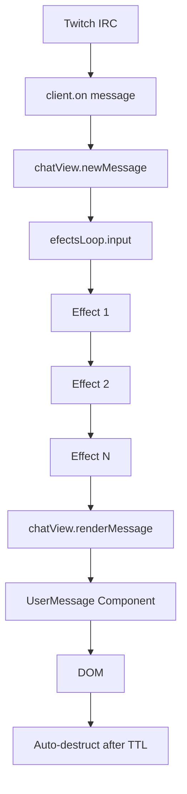

# 📚 API Documentation - CVTalk

Documentación completa de la API interna de CVTalk.

## 🌐 Objeto Global: `window.OBSChat`

Objeto global que gestiona la configuración y estado de la aplicación.

### Properties

```typescript
interface OBSChat {
  properties?: Properties
  appCustomElements?: Record<string, CustomElementConstructor>
  addCustomElement: (name: string, constructor: CustomElementConstructor) => void
  messages: Record<string, Message>
  addMessage: (messageInfo: UserMessageInfoType) => string
}
```

#### `properties`

Configuración global de la aplicación.

```typescript
type Properties = {
  channel?: string        // Canal de Twitch
  messageTTL: number     // Tiempo de vida de mensajes (ms)
  pato_bot: boolean      // Habilitar PatoBotTribute
}
```

**Valores por defecto:**
```typescript
{
  messageTTL: 10000,
  pato_bot: false
}
```

#### `appCustomElements`

Registro de todos los custom elements definidos.

```typescript
{
  "chat-view": ChatView,
  "user-message": UserMessage
}
```

#### `addCustomElement(name, constructor)`

Registra un nuevo custom element en la aplicación.

**Parámetros:**
- `name` (string): Nombre del elemento (ej: "my-component")
- `constructor` (CustomElementConstructor): Clase que extiende HTMLElement

**Ejemplo:**
```typescript
window.OBSChat.addCustomElement("my-component", MyComponent)
```

#### `messages`

Almacén de mensajes activos indexados por ID.

```typescript
messages: Record<string, Message>
```

**Estructura de Message:**
```typescript
type Message = UserMessageInfoType & {
  delete: () => void
}
```

#### `addMessage(messageInfo)`

Agrega un mensaje al almacén global.

**Parámetros:**
- `messageInfo` (UserMessageInfoType): Información del mensaje

**Retorna:** `string` - ID único del mensaje

**Ejemplo:**
```typescript
const messageId = window.OBSChat.addMessage(message)
```

## 🎨 Custom Elements

### ChatView

Componente principal que gestiona la lista de mensajes.

```typescript
class ChatView extends HTMLElement {
  list: HTMLUListElement | null
  efectsLoop: EfectsLoop
  
  constructor()
  newMessage(message: UserMessageInfoType): void
  private renderMessage(message: UserMessageInfoType): void
}
```

#### Propiedades

- **`list`**: Referencia al elemento `<ul>` que contiene los mensajes
- **`efectsLoop`**: Instancia del sistema de procesamiento de efectos

#### Métodos

##### `newMessage(message)`

Procesa un nuevo mensaje a través del sistema de efectos.

**Parámetros:**
- `message` (UserMessageInfoType): Mensaje de Twitch IRC

**Ejemplo:**
```typescript
chatView.newMessage({
  type: "message",
  username: "usuario",
  message: "Hola chat!",
  // ...
})
```

##### `renderMessage(message)` (private)

Renderiza un mensaje procesado en el DOM.

### UserMessage

Componente que muestra un mensaje individual de usuario.

```typescript
class UserMessage extends HTMLElement {
  static observedAttributes: string[]
  
  constructor(element?: HTMLElement)
  attributeChangedCallback(name: string, old: string | null, now: string): void
  private onNewMessage(message: UserMessageInfoType): void
  private selfDestruct(): void
}
```

#### Atributos Observados

- **`message`**: ID del mensaje en `window.OBSChat.messages`

#### Métodos

##### `onNewMessage(message)` (private)

Renderiza la información del mensaje en el componente.

**Elementos actualizados:**
- Avatar del usuario
- Nombre de usuario con color
- Badges primarios y secundarios
- Contenido del mensaje
- Ornamentos según rol

##### `selfDestruct()` (private)

Inicia temporizador de auto-destrucción basado en `messageTTL`.

**Flujo:**
1. Espera `messageTTL` ms
2. Agrega clase `fade-out`
3. Espera 1000ms (animación)
4. Elimina elemento del DOM
5. Elimina mensaje de `window.OBSChat.messages`

## 🔌 Sistema de Efectos

### EfectsLoop

Gestor de cadena de efectos para procesamiento de mensajes.

```typescript
class EfectsLoop {
  private effects: Effect[]
  private outputs: Output[]
  
  addEffect(effect: Effect): void
  addOutput(output: Output): void
  input(message: UserMessageInfoType): void
  private outputEffect(message: UserMessageInfoType): void
}
```

#### Métodos

##### `addEffect(effect)`

Agrega un efecto a la cadena de procesamiento.

**Parámetros:**
- `effect` (Effect): Función de efecto

**Ejemplo:**
```typescript
efectsLoop.addEffect((message, next) => {
  console.log(message.message)
  next()
})
```

##### `addOutput(output)`

Agrega una función de salida para mensajes procesados.

**Parámetros:**
- `output` (Output): Función que recibe mensaje final

**Ejemplo:**
```typescript
efectsLoop.addOutput((message) => {
  console.log("Mensaje listo:", message)
})
```

##### `input(message)`

Procesa un mensaje a través de todos los efectos.

**Parámetros:**
- `message` (UserMessageInfoType): Mensaje a procesar

### Types

```typescript
type Effect = (message: UserMessageInfoType, next: RunNextEffect) => void
type RunNextEffect = () => void
type Output = (message: UserMessageInfoType) => void
```

## 🛠️ Utilidades

### getCuratedColor

Genera un color RGB oscurecido para mejor legibilidad.

```typescript
function getCuratedColor(color: string | undefined): string
```

**Parámetros:**
- `color`: Color hexadecimal (`#RRGGBB`) o `undefined` para aleatorio

**Retorna:** Color en formato `rgb(r, g, b)`

**Ejemplo:**
```typescript
const color = getCuratedColor("#FF0000")
// Retorna: "rgb(255, 128, 128)"
```

### getOrnament

Determina el ornamento (rol) de un usuario.

```typescript
function getOrnament(message: UserMessageInfoType): OrnamentClass
```

**Parámetros:**
- `message`: Información del mensaje

**Retorna:** `"broadcaster" | "moderator" | "vip" | "subscriber" | ""`

**Ejemplo:**
```typescript
const ornament = getOrnament(message)
if (ornament) {
  element.classList.add(ornament)
}
```

### getPythonesaMessage

Genera un mensaje mock para pruebas o mensajes del sistema.

```typescript
function getPythonesaMessage(message: string): UserMessageInfoType
```

**Parámetros:**
- `message`: Texto del mensaje

**Retorna:** Objeto `UserMessageInfoType` completo

**Ejemplo:**
```typescript
const mockMsg = getPythonesaMessage("Error: Canal no especificado")
chatView.newMessage(mockMsg)
```

### useTemplate

Clona y agrega un template HTML al elemento.

```typescript
function useTemplate(
  element: HTMLElement,
  templateSelector: string,
  contentSelector?: string
): void
```

**Parámetros:**
- `element`: Elemento donde se clonará el template
- `templateSelector`: Selector CSS del template
- `contentSelector`: (Opcional) Selector del contenedor de contenido

**Ejemplo:**
```typescript
useTemplate(this, "#user-message", ".message")
```

### createTimeout

Crea un timeout que se puede limpiar globalmente.

```typescript
function createTimeout(callback: () => void, ms: number): number
```

**Parámetros:**
- `callback`: Función a ejecutar
- `ms`: Milisegundos de espera

**Retorna:** ID del timeout

**Ejemplo:**
```typescript
const timeoutId = createTimeout(() => {
  console.log("Ejecutado después de 1s")
}, 1000)
```

## 📡 Cliente Twitch IRC

### Conexión

```typescript
import { client } from "mtmi"

client.connect({
  channels: [channel],
  badges: badges,
  avatarProvider: "decapi"
})
```

### Eventos

```typescript
// Mensaje de chat
client.on("message", (message: UserMessageInfoType) => {
  chatView.newMessage(message)
})

// Suscripción
client.on("sub", (data) => {
  console.log("SUB:", data)
})

// Resuscripción
client.on("resub", (data) => {
  console.log("RESUB:", data)
})

// Regalo de suscripción
client.on("subgift", (data) => {
  console.log("SUBGIFT:", data)
})

// Ban
client.on("ban", (data) => {
  console.log("BAN:", data)
})

// Timeout
client.on("timeout", (data) => {
  console.log("TIMEOUT:", data)
})

// Raid
client.on("raid", (data) => {
  console.log("RAID:", data)
})

// Bits
client.on("bits", (data) => {
  console.log("BITS:", data)
})

// Anuncio
client.on("announcement", (data) => {
  console.log("ANNOUNCEMENT:", data)
})
```

## 📦 Types

### UserMessageInfoType

```typescript
interface UserMessageInfoType {
  type: string
  username: string
  message: string
  badges: Badge[]
  userInfo: UserInfo
  messageInfo: MessageInfo
}
```

### Badge

```typescript
interface Badge {
  name: string
  value: string
  image: string
  description: string
  fullMonths?: number
}
```

### UserInfo

```typescript
interface UserInfo {
  displayName: string
  color: string
  isMod: boolean
  isVip: boolean
  isSub: boolean
  avatar?: Promise<string>
}
```

### MessageInfo

```typescript
interface MessageInfo {
  message: string | HTMLElement
  emotes?: Emote[]
}
```

## 🎯 Flujo de Datos



## 🔐 Seguridad

- **No se almacenan credenciales** en el código
- **Conexión anónima** a Twitch IRC (solo lectura)
- **No se requiere OAuth** para leer chat público
- **Sanitización de HTML** en mensajes

## ⚡ Performance

### Optimizaciones

- **Custom Elements nativos** - sin framework overhead
- **Lazy loading** de avatares
- **Carga asíncrona** de badges
- **Auto-limpieza** de mensajes antiguos
- **Preload** de recursos de audio

### Métricas

- **Tiempo de carga inicial**: ~500ms
- **Memoria por mensaje**: ~10KB
- **FPS durante stream**: 60fps estable
- **CPU usage**: <5%

---

Para más ejemplos y guías, consulta [EFFECTS.md](./EFFECTS.md)
