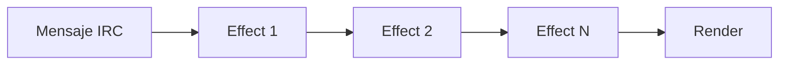

# 🔌 Sistema de Efectos - CVTalk

El sistema de efectos de CVTalk permite procesar mensajes de Twitch en una cadena de middleware antes de renderizarlos en pantalla. Esta arquitectura extensible permite agregar funcionalidades personalizadas sin modificar el código core.

## 📋 Tabla de Contenidos

- [Conceptos Básicos](#conceptos-básicos)
- [Arquitectura](#arquitectura)
- [Crear un Efecto](#crear-un-efecto)
- [Ejemplos](#ejemplos)
- [API Reference](#api-reference)
- [Efectos Incluidos](#efectos-incluidos)

## 🎯 Conceptos Básicos

### ¿Qué es un Efecto?

Un efecto es una función que:
1. Recibe un mensaje de Twitch
2. Procesa o modifica el mensaje (opcional)
3. Llama al siguiente efecto en la cadena

```typescript
type Effect = (message: UserMessageInfoType, next: RunNextEffect) => void
```

### Flujo de Procesamiento



## 🏗️ Arquitectura

### EfectsLoop

La clase `EfectsLoop` gestiona la cadena de efectos:

```typescript
class EfectsLoop {
  private effects: Effect[] = []
  private outputs: Output[] = []
  
  addEffect(effect: Effect): void
  addOutput(output: Output): void
  input(message: UserMessageInfoType): void
}
```

#### Métodos

- **`addEffect(effect)`**: Agrega un efecto a la cadena
- **`addOutput(output)`**: Agrega una función de salida que recibe mensajes procesados
- **`input(message)`**: Procesa un mensaje a través de todos los efectos

### Orden de Ejecución

Los efectos se ejecutan en el **orden en que fueron agregados**:

```typescript
efectsLoop.addEffect(effect1) // Se ejecuta primero
efectsLoop.addEffect(effect2) // Se ejecuta segundo
efectsLoop.addEffect(effect3) // Se ejecuta tercero
```

## ✨ Crear un Efecto

### Estructura Básica

```typescript
// src/lib/efects_loop/efects/mi_efecto.ts
import type { Effect } from "../index"
import { type UserMessageInfoType } from "mtmi"

export default class MiEfecto {
  constructor() {
    // Inicialización
    console.log("MiEfecto inicializado")
  }
  
  public getEfect(): Effect {
    return (message, next) => {
      // Tu lógica aquí
      console.log("Procesando mensaje:", message.message)
      
      // IMPORTANTE: Llamar a next() para continuar la cadena
      next()
    }
  }
}
```

### Registrar el Efecto

```typescript
// src/components/chat-view/index.ts
import MiEfecto from "@/lib/efects_loop/efects/mi_efecto"

constructor() {
  super()
  this.efectsLoop = new EfectsLoop()
  this.efectsLoop.addOutput(this.renderMessage.bind(this))
  
  // Agregar tu efecto
  const miEfecto = new MiEfecto()
  this.efectsLoop.addEffect(miEfecto.getEfect())
}
```

### Hacer el Efecto Configurable

```typescript
// Agregar propiedad en global.ts
export type Properties = {
  channel?: string
  messageTTL: number
  pato_bot: boolean
  mi_efecto: boolean  // Nueva propiedad
}

const defaultProperties: Properties = {
  messageTTL: 10000,
  pato_bot: false,
  mi_efecto: false  // Valor por defecto
}

// Usar en chat-view
if (window.OBSChat.properties?.mi_efecto) {
  const miEfecto = new MiEfecto()
  this.efectsLoop.addEffect(miEfecto.getEfect())
}
```

Ahora puedes habilitar el efecto con: `?channel=micanal&mi_efecto=true`

## 📝 Ejemplos

### Ejemplo 1: Filtro de Palabras

```typescript
export default class WordFilter {
  private bannedWords = ["spam", "scam"]
  
  public getEfect(): Effect {
    return (message, next) => {
      // Filtrar palabras prohibidas
      let filtered = message.message
      this.bannedWords.forEach(word => {
        const regex = new RegExp(word, "gi")
        filtered = filtered.replace(regex, "***")
      })
      
      message.message = filtered
      next()
    }
  }
}
```

### Ejemplo 2: Contador de Mensajes

```typescript
export default class MessageCounter {
  private count = 0
  private userCounts: Map<string, number> = new Map()
  
  public getEfect(): Effect {
    return (message, next) => {
      this.count++
      
      const username = message.username
      const userCount = this.userCounts.get(username) || 0
      this.userCounts.set(username, userCount + 1)
      
      console.log(`Total messages: ${this.count}`)
      console.log(`${username} messages: ${userCount + 1}`)
      
      next()
    }
  }
}
```

### Ejemplo 3: Modificar Avatar según Contenido

```typescript
export default class EmojiAvatar {
  private emojiAvatars = {
    "❤️": "/assets/avatars/heart.png",
    "😂": "/assets/avatars/laugh.png",
    "🔥": "/assets/avatars/fire.png"
  }
  
  public getEfect(): Effect {
    return (message, next) => {
      for (const [emoji, avatar] of Object.entries(this.emojiAvatars)) {
        if (message.message.includes(emoji)) {
          message.userInfo.avatar = (async () => avatar)()
          break
        }
      }
      next()
    }
  }
}
```

### Ejemplo 4: Efecto con Audio

```typescript
export default class SoundEffect {
  private audio: HTMLAudioElement
  private audioUnlocked = false
  
  constructor() {
    this.audio = new Audio("/assets/audio/notification.mp3")
    this.audio.volume = 0.5
    this.unlockAudio()
  }
  
  private unlockAudio() {
    const unlock = async () => {
      try {
        this.audio.volume = 0
        await this.audio.play()
        this.audio.pause()
        this.audio.currentTime = 0
        this.audio.volume = 0.5
        this.audioUnlocked = true
        document.removeEventListener("click", unlock)
      } catch (e) {
        console.log("Esperando interacción del usuario")
      }
    }
    document.addEventListener("click", unlock, { once: true })
  }
  
  private async playSound() {
    try {
      this.audio.currentTime = 0
      await this.audio.play()
    } catch (error) {
      console.warn("No se pudo reproducir el audio:", error)
    }
  }
  
  public getEfect(): Effect {
    return (message, next) => {
      if (message.message.includes("!alert")) {
        this.playSound()
      }
      next()
    }
  }
}
```

### Ejemplo 5: Efecto Asíncrono

```typescript
export default class TranslatorEffect {
  public getEfect(): Effect {
    return async (message, next) => {
      // Traducir si el mensaje contiene cierto comando
      if (message.message.startsWith("!translate ")) {
        const text = message.message.replace("!translate ", "")
        
        try {
          const translated = await this.translateText(text)
          message.message = `${text} → ${translated}`
        } catch (error) {
          console.error("Error traduciendo:", error)
        }
      }
      
      next()
    }
  }
  
  private async translateText(text: string): Promise<string> {
    // Implementar traducción (API externa)
    return `[Traducción de: ${text}]`
  }
}
```

## 📖 API Reference

### Effect Type

```typescript
type Effect = (message: UserMessageInfoType, next: RunNextEffect) => void
```

**Parámetros:**
- `message`: Objeto completo del mensaje de Twitch
- `next`: Función para ejecutar el siguiente efecto

### RunNextEffect Type

```typescript
type RunNextEffect = () => void
```

Debe llamarse al final del efecto para continuar la cadena.

### Output Type

```typescript
type Output = (message: UserMessageInfoType) => void
```

Función que recibe el mensaje procesado final.

### UserMessageInfoType

```typescript
interface UserMessageInfoType {
  type: string
  username: string
  message: string
  badges: Badge[]
  userInfo: UserInfo
  messageInfo: MessageInfo
}
```

## 🦆 Efectos Incluidos

### PatoBotTribute

**Tributo a PatoBot** - Homenaje al legendario bot creado por **Nivek el pato** (más tarde conocido como **PatitoDev**), un querido amigo y gran creador de contenido que se retiró del streaming. Este efecto mantiene vivo el legado de PatoBot en la comunidad.

**Historia**: PatoBot fue un bot icónico que traía alegría a los chats con sus característicos "*quack*". Aunque el bot ya no está en funcionamiento debido al retiro de su creador, este efecto asegura que su espíritu perdure en nuestros streams.

**Activación:** `?pato_bot=true`

**Comportamiento:**
- Detecta mensajes con `*quack*`
- Reproduce sonido de pato (`/assets/audio/quack.mp3`)
- Cambia el avatar del usuario por uno aleatorio de pato
- Maneja políticas de autoplay del navegador

**Código:**
```typescript
if (message.message.includes("*quack*")) {
  message.userInfo.avatar = (async () => {
    return this.duckAvatars[Math.floor(Math.random() * this.duckAvatars.length)]
  })()
  this.playQuack()
}
```

---

### 😺 cuteMichi

**Convierte emoticones `:3` en "AliMoyi".**

**Activación:** Siempre activo

**Comportamiento:**
- Detecta el emoticón `:3` en mensajes
- Lo reemplaza con el emoji 😺 en HTML
- Lo reemplaza con el texto "AliMoyi" en texto plano

**Ejemplo:**
```
Entrada: "Hola :3 cómo estás"
Salida HTML: "Hola 😺 cómo estás"
Salida texto: "Hola AliMoyi cómo estás"
```

---

### ❤️ afordiLove

**Reemplaza corazones genéricos con el emote personalizado "afordiLove".**

**Activación:** Siempre activo

**Comportamiento:**
- Detecta `<3` y `❤️` en texto
- Reemplaza con el texto `afordiLove`
- Cambia emote de Twitch genérico (ID: 555555584) por afordiLove (ID: emotesv2_2440c347e7344f0b9248beb83aa4ac87)

**Ejemplo:**
```
Entrada: "Te quiero <3"
Salida:  "Te quiero afordiLove"
```

---

### 🚫🔗 antiLinks

**Censura enlaces/URLs en mensajes de chat.**

**Activación:** Siempre activo

**Comportamiento:**
- Detecta URLs usando regex y validador
- Los moderadores y broadcaster están exentos
- Reemplaza URLs con `[🚫🔗]` en HTML
- Reemplaza con `(Usuario envió un link)` en texto plano

**Ejemplo:**
```
Entrada: "Mira esto https://example.com"
Salida HTML: "Mira esto [🚫🔗]"
Salida texto: "Mira esto (NombreUsuario envió un link)"
```

---

### 🦆 antiGoose

**Reemplaza menciones de "goose"/"ganso" por "duck"/"pato".**

**Activación:** Siempre activo

**Comportamiento:**
- Detecta "goose", "ganso", "ganzo" (incluso con espacios: "g o o s e")
- Reemplaza "goose" → "duck"
- Reemplaza "ganso"/"ganzo" → "pato"
- Usa regex dinámico para detectar variaciones con espacios

**Ejemplo:**
```
Entrada: "I love g o o s e"
Salida:  "I love duck"

Entrada: "El g a n s o es bonito"
Salida:  "El pato es bonito"
```

---

### 🚫📏 antiLongWords

**Censura palabras excesivamente largas (spam).**

**Activación:** Siempre activo

**Comportamiento:**
- Detecta palabras mayores a 23 caracteres (más largas que "electroencefalografista")
- Reemplaza con `[🚫📏]` en HTML
- Reemplaza con una palabra turca famosamente larga en texto plano

**Ejemplo:**
```
Entrada: "esto es aaaaaaaaaaaaaaaaaaaaaaaaa spam"
Salida HTML: "esto es [🚫📏] spam"
Salida texto: "esto es Muvaffakiyetsezlestiricilestiriveremeyebileceklerimizdenmissinizcesine spam"
```

---

### 🤖 muteBots

**Silencia mensajes provenientes de bots.**

**Activación:** `?mute_bots=true`

**Comportamiento:**
- Verifica si `message.userInfo.isBot === true`
- Si es bot, interrumpe la cadena de efectos (no llama a `next()`)
- El mensaje no se renderiza en el chat

**Ejemplo de uso:**
```
URL: ?channel=micanal&mute_bots=true
```

---

### 🔇 muteCommandsByPrefix

**Silencia mensajes que comienzan con prefijos específicos.**

**Activación:** `?mute_prefixes=!,.,/` (separar prefijos con comas)

**Comportamiento:**
- Verifica si el mensaje comienza con alguno de los prefijos configurados
- Si coincide, interrumpe la cadena de efectos
- Útil para ocultar comandos de bots

**Nota especial:** Incluye una excepción hardcodeada para el comando `!hit @jp__is` (A.K.A. e4yttuh).

**Ejemplo de uso:**
```
URL: ?channel=micanal&mute_prefixes=!,.,/

"!comando" → no se muestra
".roll 6" → no se muestra
"Hola chat" → se muestra normalmente
```

---

### 💬 muteReplays

**Silencia mensajes que son respuestas a otros mensajes.**

**Activación:** `?mute_replays=true`

**Comportamiento:**
- Verifica si el mensaje tiene información de reply (`message.replyInfo`)
- Si es una respuesta, interrumpe la cadena de efectos (no llama a `next()`)
- El mensaje no se renderiza en el chat
- Útil para mantener el chat limpio de conversaciones anidadas

**Autor:** tadeo_dev

**Ejemplo de uso:**
```
URL: ?channel=micanal&mute_replays=true

Usuario1: "Hola chat"
Usuario2: "@Usuario1 Hola!" → no se muestra (es un reply)
Usuario3: "¿Qué tal?" → se muestra normalmente
```

---

### 🎙️ commandsProcessor

**Procesador de comandos TTS (Text-to-Speech).**

**Activación:** `?tts=true` (junto con `tts_accent` y `tts_variant` opcionales)

**Comportamiento:**
- Intercepta comandos especiales en el chat
- Procesa comandos TTS para sintetizar voz
- Ignora mensajes de bots
- Si un comando retorna `true`, el mensaje no se renderiza

**Comandos soportados:**
- `!speak <texto>` - Sintetiza el texto con configuración predeterminada
- `!s <texto>` - Alias corto de !speak
- `!speak <acento> <texto>` - Sintetiza con acento específico (ej: es-AR, en-US)
- `!speak <acento> <variante> <texto>` - Sintetiza con acento y variante
- `!speak -config <acento> [variante]` - Configura preferencias del usuario
- `!speak -reset` - Resetea la configuración personalizada

**Características:**
- Configuración personalizada por usuario guardada en localStorage
- Validación de acentos y variantes disponibles en el sistema
- Fallback a configuración global si el usuario no tiene preferencias

**Ejemplo de uso:**
```
URL: ?channel=micanal&tts=true&tts_accent=es-AR&tts_variant=1

Usuario: "!speak Hola mundo"
[Sintetiza "Hola mundo" con es-AR, variante 1]

Usuario: "!speak -config es-MX 2"
[Guarda preferencia: español mexicano, variante 2]

Usuario: "!speak Buenos días"
[Sintetiza con su configuración guardada: es-MX, variante 2]

Usuario: "!speak en-US 1 Hello world"
[Sintetiza "Hello world" con inglés estadounidense, variante 1]
```

**Implementación:**
- Usa la clase `TTS` para síntesis de voz (singleton)
- Usa la clase `TTSConfigVault` para gestionar configuraciones personalizadas
- Usa `ComManzContainer` para registrar y buscar comandos mediante árbol de decisión

---

## 🎓 Mejores Prácticas

### ✅ DO

- **Siempre llama a `next()`** al final de tu efecto
- **Usa console.log** para debugging durante desarrollo
- **Maneja errores** con try-catch en operaciones asíncronas
- **Documenta tu efecto** con JSDoc
- **Prueba efectos aislados** antes de integrarlos

### ❌ DON'T

- **No modifiques** el objeto mensaje si no es necesario
- **No olvides** llamar a `next()` (rompe la cadena)
- **No bloquees** el thread principal con operaciones pesadas
- **No uses** efectos para lógica de renderizado (usa outputs)
- **No dependas** de orden de otros efectos no controlados

## 🔍 Debugging

### Ver el flujo de efectos

```typescript
public getEfect(): Effect {
  return (message, next) => {
    console.log("⬇️ [MiEfecto] Entrada:", message.message)
    
    // Tu lógica
    
    console.log("⬆️ [MiEfecto] Salida:", message.message)
    next()
  }
}
```

### Verificar que se llama next()

```typescript
public getEfect(): Effect {
  return (message, next) => {
    // Tu lógica
    
    console.log("✅ [MiEfecto] Llamando next()")
    next()
  }
}
```

## 🤝 Compartir Efectos

Si creas un efecto útil, considera:

1. Documentarlo en este archivo
2. Agregar pruebas
3. Hacer un PR al repositorio
4. Compartirlo con la comunidad

---

¿Preguntas? Abre un issue en GitHub o únete a nuestra comunidad.
